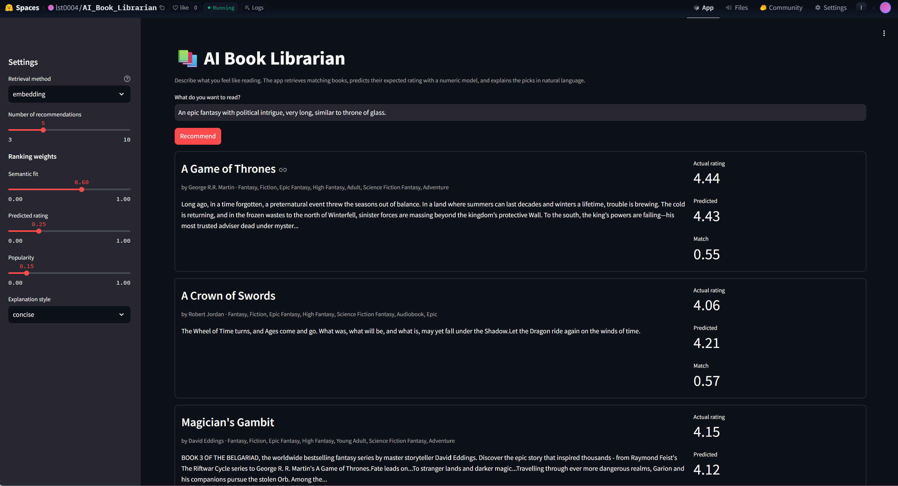
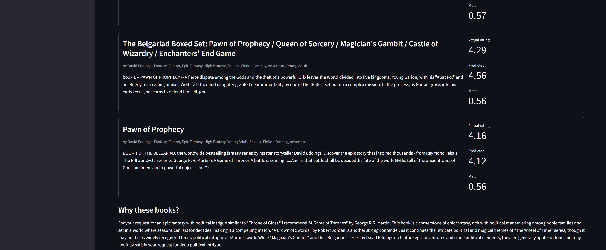
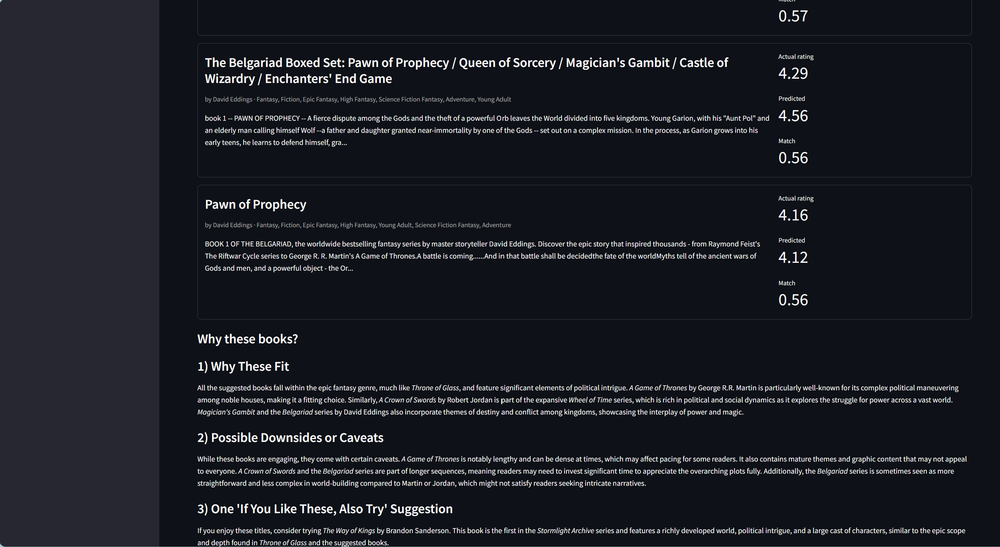
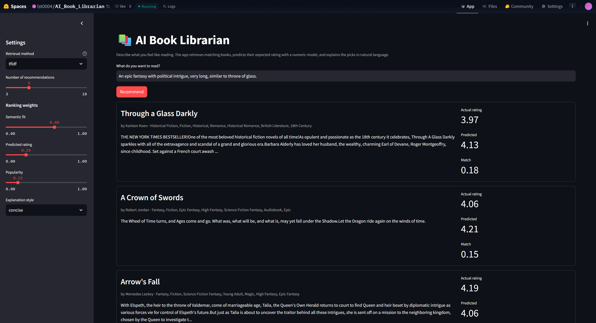
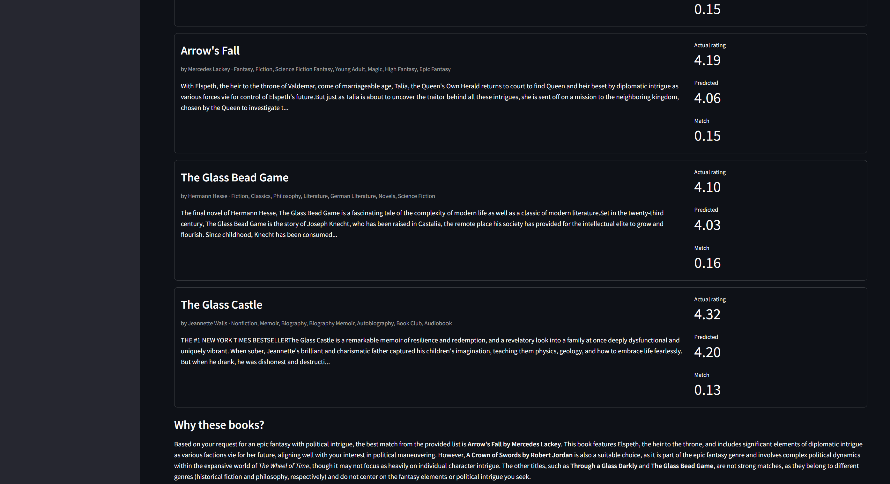
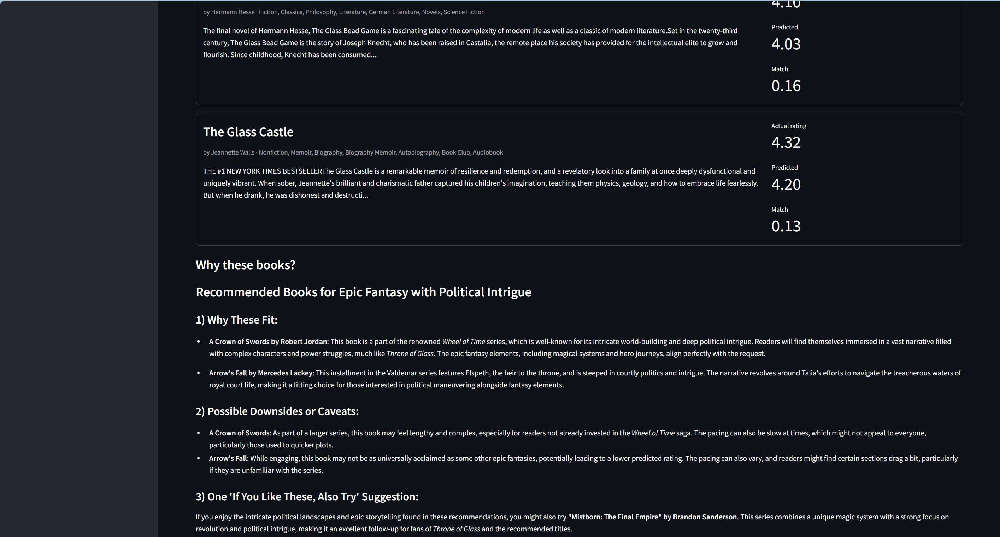
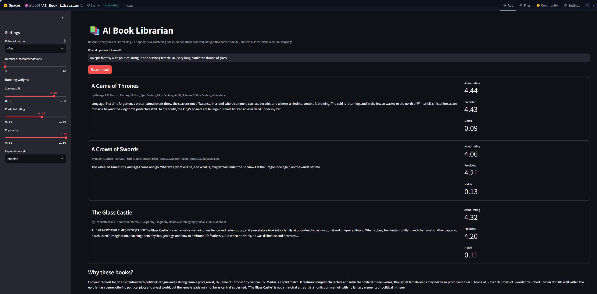
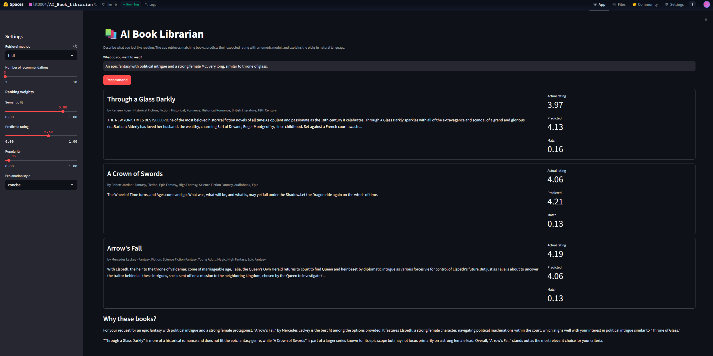

# AI Applications Project Documentation Template

## Documentation Hint

Code references link directly to the relevant function and line range on GitHub
(e.g. [`train.py` `main()`](https://github.com/ls00X/ai-book-librarian/blob/main/src/train.py#L71-L143)), so reviewers can jump straight to the implementation.

## Project Metadata

- Project title: AI Book Librarian – Personalized Book Recommendation with Rating Prediction and Natural Language Explanations
- Student: Laura Stärk
- GitHub repository URL: https://github.com/ls00X/ai-book-librarian
- Deployment URL: https://huggingface.co/spaces/lst0004/AI_Book_Librarian
- Submission date: 06.06.2026

### Mandatory Setup Checks

- [x] At least 2 blocks selected
- [x] Multiple and different data sources used
- [x] Deployment URL provided
- [x] Required GitHub users added to repository (`jasminh`, `bkuehnis`)

## Selected AI Blocks

- [x] ML Numeric Data
- [x] NLP
- [ ] Computer Vision

Primary blocks used for core solution (choose 2):

- Primary block 1: NLP (semantic retrieval, review sentiment, LLM explanation)
- Primary block 2: ML Numeric Data (rating prediction)

If a third block is selected, it is documented and graded separately as extra work. — N/A

---

## 1. Project Foundation (Short)

### 1.1 Problem Definition

- Problem statement: Readers struggle to find their next book from huge catalogs; keyword search ignores mood/theme, and a single global average rating says nothing about fit. There is no tool that combines *what a reader wants in natural language* with *how well-received a book is* and *explains the choice*.
- Goal: Take a free-text request (favourite book / genre / mood), return a ranked shortlist combining semantic fit, a predicted rating and popularity, and produce an honest natural-language explanation.
- Success criteria: (1) rating model beats the mean-rating baseline on RMSE; (2) embedding retrieval returns topically relevant books (qualitative check + vs. TF-IDF baseline); (3) explanations are grounded in the actual retrieved data; (4) a working deployed app.

### 1.2 Integration Logic

- How the selected blocks interact: 
  - NLP → ML: review sentiment (VADER) is aggregated per book and used as a **feature** in the rating model — see [`data_prep.py` `attach_sentiment()`](https://github.com/ls00X/ai-book-librarian/blob/main/src/data_prep.py#L126-135) and the `NUMERIC` feature list in [`train.py`](https://github.com/ls00X/ai-book-librarian/blob/main/src/train.py#L34).
  - ML → NLP: the trained model's **predicted_rating** is written into the catalog ([`train.py` `main()`](https://github.com/ls00X/ai-book-librarian/blob/main/src/train.py#L71-L143)), then used as a ranking term ([`recommend.py` `Recommender.recommend()`](https://github.com/ls00X/ai-book-librarian/blob/main/src/recommend.py#L42-L65)) and as grounding in the LLM prompt ([`explain.py` `_books_block()`](https://github.com/ls00X/ai-book-librarian/blob/main/src/explain.py#L33-L46)).
- Data and output flow between blocks:

```
reviews (book_reviews.db) ──VADER──▶ sentiment feature ─┐
                                                        │
book metadata + native descriptions (Book_Details.csv) ┼─▶ ML rating model ─▶ predicted_rating
                                                        │                            │
user query ──embedding search──▶ candidates ──▶ ranking(semantic + predicted rating + popularity) ──▶ top-k ──▶ LLM explanation
```

---

## 2. Block Documentation

### 2A. ML Numeric Data (If selected)

#### 2A.1 Data Source(s)

| Entry | Source name or link | Type | Size | Role in this block |
| --- | --- | --- | --- | --- |
| 1 | Book_Details.csv (Kaggle: https://www.kaggle.com/datasets/dk123891/books-dataset-goodreadsmay-2024?select=Book_Details.csv) | Structured CSV | ~16k books, 4,000 used (ENRICH_LIMIT=4000) | Metadata features + target (`average_rating`) |
| 2 | book_reviews.db (same Kaggle collection: https://www.kaggle.com/datasets/dk123891/books-dataset-goodreadsmay-2024?select=book_reviews.db) | SQLite review text | ~63k reviews | Source of the NLP-derived `sentiment_compound` feature (joined on `book_id`) |

#### 2A.2 Preprocessing and Features

- Cleaning steps: strip stray header spaces; parse num_pages from its list-string form (e.g. ['652']); extract publication_year from the publication_info string (e.g. ['First published July 16, 2005']); coerce numeric columns; drop rows without a title or average_rating; de-duplicate on the canonical book_id (derived from the native book_id):[`load_books()` in `src/data_prep.py`](https://github.com/ls00X/ai-book-librarian/blob/main/src/data_prep.py#L81-L107).
- Preprocessing steps: median-impute + standardize the numeric features; log1p on the highly skewed ratings_count / text_reviews_count; genre one-hots passed through unchanged. (This dataset has no language column, so no categorical encoder is applied.) [`build_preprocessor()`](https://github.com/ls00X/ai-book-librarian/blob/main/src/train.py#L55-L68) / [`load_xy()`](https://github.com/ls00X/ai-book-librarian/blob/main/src/train.py#L38-L52) in `src/train.py` (https://github.com/ls00X/ai-book-librarian/blob/main/src/train.py).
- Feature engineering and selection: 20 features = 5 numeric (num_pages, log ratings_count, log text_reviews_count, publication_year, sentiment_compound) + 15 genre one-hots. sentiment_compound is the NLP-derived feature; rating_distribution is deliberately excluded because it is the star breakdown that defines average_rating (target leakage).
- Exploratory data analysis (key findings) — from [`notebooks/eda.ipynb`](https://github.com/ls00X/ai-book-librarian/blob/main/notebooks/eda.ipynb):
  - The target average_rating is narrow: mean 3.99, std 0.26, range 2.40–4.81, concentrated around 4.0. A mean-only baseline therefore already achieves RMSE = 0.26, the bar any model must beat.
  - ratings_count and text_reviews_count are extremely right-skewed → log-transformed (roughly normal after log1p).
  - Correlations with average_rating are modest: num_pages 0.24 (strongest), log ratings_count 0.15, sentiment_compound 0.13, text_reviews_count 0.06, publication_year 0.05. ratings_count and text_reviews_count are nearly collinear (r = 0.94).
  - Sentiment coverage is partial: 3,589 / 4,000 books (90%) have at least one matched review; the rest are median-imputed.
  - Genre distribution is dominated by Fiction (3,224), Classics (1,418) and Fantasy (1,169).

#### 2A.3 Model Selection

- Models tested: Ridge regression, Random Forest, Gradient Boosting (and XGBoost if installed).
- Why these models were chosen: Ridge = linear baseline; tree ensembles capture non-linear interactions between popularity, length and sentiment; spanning linear→ensemble shows whether complexity is justified on a narrow target.

#### 2A.4 Model Comparison and Iterations

The final model was trained directly with the complete feature set. To document the development
path, an ablation was run on the strongest model (Gradient Boosting): once without the NLP-derived
`sentiment_compound` feature, once with it. The full four-model comparison is in 2A.5.

| Iteration | Setup | Hold-out RMSE | R² | CV RMSE | vs. previous |
| --- | --- | --- | --- | --- | --- |
| Baseline | predict the global mean rating for every book | 0.260 | 0.000 | — | — |
| 1 — without sentiment | full features minus `sentiment_compound` (GB) | 0.221 | 0.268 | 0.224 | beats baseline |
| 2 — with sentiment | full feature set (GB, final model) | 0.220 | 0.273 | 0.222 | −0.001 RMSE / +0.005 R² |

Adding `sentiment_compound` improved hold-out RMSE from 0.221 to 0.220 and R² from 0.268 to 0.273 —
a marginal but consistent gain. The same small improvement appears across the other model families
(e.g. RandomForest 0.224 → 0.223, XGBoost 0.224 → 0.222), so the effect is real but model-agnostic
and limited, consistent with the weak per-book sentiment–rating correlation (r = 0.13, see 2A.2).

#### 2A.5 Evaluation and Error Analysis

- Metrics used: RMSE, MAE, R² on a 20% hold-out + 5-fold CV [`src/train.py`](https://github.com/ls00X/ai-book-librarian/blob/main/src/train.py).
- Final results: 
  Baseline for comparison: predicting the global mean rating for every book yields RMSE = 0.26 (R² = 0). All trained models beat this baseline, and the positive R² confirms the model explains variance the mean cannot. Gradient Boosting performs best:
  Model	RMSE	MAE	R²	CV RMSE
  Ridge Regression	0.226	0.176	0.234	0.226
  Random Forest	0.223	0.170	0.252	0.223
  Gradient Boosting	0.220	0.170	0.273	0.222
  XGBoost	0.222	0.170	0.261	0.220

  Gradient Boosting achieved the best overall performance with the lowest hold-out RMSE (0.220) and the highest R² (0.273). Therefore, it was selected as the final production model and saved as rating_model.joblib.

- Error patterns and likely causes: largest residuals can be inspected in [`reports/worst_predictions.csv`](https://github.com/ls00X/ai-book-librarian/blob/main/reports/worst_predictions.csv). The largest prediction errors occur mainly for niche books with few ratings and for books whose popularity or reception is not fully captured by the available metadata. The relatively narrow Goodreads rating distribution also limits the achievable R². Among the features, num_pages is the strongest single correlate of average_rating (r = 0.24), while ratings_count and text_reviews_count are nearly collinear (r = 0.94), so they add little independent signal.


#### 2A.6 Integration with Other Block(s)

- Inputs received from other block(s): `sentiment_compound` from the NLP sentiment step.
- Outputs provided to other block(s): `predicted_rating` per book → ranking term and LLM grounding.

### 2B. NLP (If selected)

#### 2B.1 Data Source(s)

| Entry | Source name or link | Type | Size | Role in this block |
| --- | --- | --- | --- | --- |
| 1 | Book_Details.csv (`book_details` field) | Text | ~16k descriptions --> 4000 embedded | Documents embedded for semantic search |
| 2 | book_reviews.db (`review_content`) | SQLite text | ~63k reviews | VADER sentiment (feeds ML) + groundable in explanations |
| 3 | User query | Text (runtime) | 1 string | Search query + LLM input |

#### 2B.2 Preprocessing and Prompt Design

- Text preprocessing: build a per-book document title + genres + description ([`_doc()` in `src/embeddings.py`](https://github.com/ls00X/ai-book-librarian/blob/main/src/embeddings.py#L19-L21)); review text truncated to 1000 chars before VADER ([`src/sentiment.py`](https://github.com/ls00X/ai-book-librarian/blob/main/src/sentiment.py#L42-L45)). The review→book sentiment join is on book_id (not on title), since reviews and metadata share the dataset's native id.
- Prompt design or retrieval setup: dense embeddings with `all-MiniLM-L6-v2`, cosine similarity, top-`CANDIDATE_POOL` then re-rank. Two LLM prompt variants ([`concise`](https://github.com/ls00X/ai-book-librarian/blob/main/src/explain.py#L15-L20), [`structured`](https://github.com/ls00X/ai-book-librarian/blob/main/src/explain.py#L21-L28)) grounded in retrieved book data — [`PROMPT_VARIANTS` in `src/explain.py`](https://github.com/ls00X/ai-book-librarian/blob/main/src/explain.py#L14-L30).

#### 2B.3 Approach Selection

- Approach used: transformer sentence-embeddings for retrieval + classical VADER for sentiment + prompt-engineered LLM (light RAG) for explanation.
- Alternatives considered: TF-IDF retrieval (kept as the comparison baseline); transformer sentiment model (VADER chosen for speed/no-download on the deadline).

#### 2B.4 Comparison and Iterations

| Iteration | Objective | Setup | Qualitative observation | Decision |
| --- | --- | --- | --- | --- |
| 1 | Retrieval baseline | TF-IDF, sparse cosine | Anchors on the surface word "Glass": returns *Through a Glass Darkly*, *The Glass Bead Game*, *The Glass Castle* (historical fiction / philosophy / memoir), all off-topic with low match scores (0.13–0.18). Only A Crown of Swords and Arrow's Fall actually fit. | — |
| 2 | Dense retrieval | MiniLM embeddings, dense cosine | On the same query returns thematically on-target epic fantasy (A Game of Thrones, A Crown of Swords, Magician's Gambit / Belgariad) with higher match scores (0.55–0.57); captures the *meaning* (epic fantasy + political intrigue) rather than the keyword. | Clearly better on mood/theme queries → chosen as default retrieval |
| 3 | Explanation prompt | concise vs. structured, same retrieved books | `concise` gives a single grounded paragraph naming why each book fits and flagging loose matches (e.g. Belgariad "more focused on adventure… a looser match"). `structured` adds explicit sections — *Why these fit* / *Possible downsides* / *If you like these, also try* (e.g. suggesting The Way of Kings / Mistborn) — more informative while staying grounded in the retrieved metadata. | `structured` recommended for richer, still honest output |

Notably, TF-IDF and dense retrieval agree only on the clear hits (A Crown of Swords and Arrow's Fall appear in both): TF-IDF's poor performance comes entirely from keyword false positives on the word "Glass". This is a concrete illustration of lexical versus semantic matching; TF-IDF scores surface token overlap, whereas the embedding model captures the underlying meaning of the request, which is why it handles abstract mood/theme queries far better.

#### 2B.5 Evaluation and Error Analysis

- Evaluation strategy: qualitative side-by-side of TF-IDF vs. embedding retrieval on a fixed set of test queries; qualitative review of both prompt variants for groundedness (does it invent facts?) and honesty (does it flag loose matches?).
- Results:
Dense retrieval using all-MiniLM-L6-v2 produced more semantically relevant recommendations than TF-IDF, especially for abstract queries describing moods, themes, or reading preferences rather than exact keywords.

The final system therefore uses dense embedding retrieval as the default recommendation method.

For explanations, two prompt variants are offered. `concise` is the app default (a single grounded paragraph); the `structured` variant is the recommended option for richer output, as it adds explicit *Why these fit* / *Possible downsides* / *If you like these, also try* sections while staying grounded in the retrieved metadata and predicted ratings. Both remain factually grounded; the choice is left to the user via the sidebar.

As a sanity check on the sentiment feature, VADER compound scores were correlated with the reviewers' own star ratings across 61,233 reviews. The correlation is weak but positive (Pearson r = 0.178); aggregated per book, mean sentiment vs. average_rating gives r = 0.13 (3,589 books). This indicates review-text sentiment carries some rating-aligned signal, while most of the rating variance comes from other factors. It is primarily a validity check on the feature. An ablation (Gradient Boosting trained with vs. without `sentiment_compound`, see 2A.4) confirms the feature yields a small but consistent improvement (hold-out RMSE 0.221 → 0.220, R² 0.268 → 0.273), in line with this weak correlation.

- Error patterns and likely causes: embedding retrieval can occasionally favor highly popular books because they have richer descriptions and metadata. Retrieval quality also depends on description coverage; books with short or missing descriptions provide weaker semantic signals.

#### 2B.6 Integration with Other Block(s)

- Inputs received from other block(s): `predicted_rating` (ML) used in ranking and shown in the explanation prompt.
- Outputs provided to other block(s): `sentiment_compound` feature feeding the ML model.

### 2C. Computer Vision (If selected)

N/A — not selected.

---

## 3. Deployment

- Deployment URL: https://huggingface.co/spaces/lst0004/AI_Book_Librarian
- Main user flow: enter a free-text reading request → view ranked book cards (actual vs. predicted rating, match score) → read the LLM "Why these books?" note. Sidebar controls retrieval method, ranking weights and explanation style.
- Screenshot or short demo:
  
  Embedding retrieval for "An epic fantasy with political intrigue, very long, similar to throne of glass." — ranked results with actual vs. predicted rating and match score. Explanation style: concise
  
  


  Embedding retrieval for "An epic fantasy with political intrigue, very long, similar to throne of glass." — ranked results with actual vs. predicted rating and match score. Explanation style: structured
  
  


  TF-IDF retrieval for "An epic fantasy with political intrigue, very long, similar to throne of glass." — ranked results with actual vs. predicted rating and match score. Explanation style: concise
  
  

 
  TF-IDF retrieval for "An epic fantasy with political intrigue, very long, similar to throne of glass." — ranked results with actual vs. predicted rating and match score. Explanation style: structured
  
  


  TF-IDF retrieval for "An epic fantasy with political intrigue, very long, similar to throne of glass." — ranked results with actual vs. predicted rating and match score. Explanation style: concise
  But with different ranking weight for popularity:

  High popularity:
  

  Low popularity:
  


---

## 4. Execution Instructions

- Environment setup: `python -m venv .venv && pip install -r requirements.txt`; set `OPENAI_API_KEY`.
- Data setup: place `Book_Details.csv` and `book_reviews.db` in `data/raw/`.
- Training command(s):
  ```bash
  python check_review_join.py
  python -m src.sentiment
  python -m src.data_prep
  python -m src.train
  python -m src.embeddings
  ```
- Inference/run command(s): `streamlit run app.py`
- Reproducibility notes: fixed `RANDOM_STATE=42`; all parameters centralized in [`src/config.py`](https://github.com/ls00X/ai-book-librarian/blob/main/src/config.py); training and inference are fully separated (the app only loads saved artifacts).

---

## 5. Optional Bonus Evidence

- [ ] Third selected block implemented with strong quality
- [ ] More than two data sources used with clear added value
- [ ] A core section is done exceptionally well
- [x] Extended evaluation (TF-IDF vs. dense retrieval; two explanation prompts; VADER-vs-star-rating sanity check)
- [ ] Ethics, bias, or fairness analysis
- [ ] Creative or exceptional use case

Evidence for selected bonus items:

- Retrieval comparison: TF-IDF versus dense transformer embeddings (`all-MiniLM-L6-v2`).
- Explanation comparison: concise versus structured prompt variants.
- Quantitative sentiment validation: VADER sentiment scores compared against 61,233 Goodreads review ratings, yielding a Pearson correlation of r = 0.178.
- Multiple evaluation perspectives combining quantitative metrics (RMSE, MAE, R², correlation analysis) and qualitative assessment (retrieval relevance and explanation quality).

